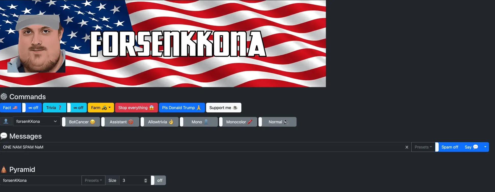

# forsenKKona an AI powered overly patriotic Twitch bot

## Functions

- Tells random facts to demonstrate the superiority of the USA (or anything you want), either one at a time or periodically
- Trolls the trivia
- Can throw walls of  periodically
- Can spam the $$xd alias (find it on [Supibot's website](https://supinic.com/bot/user/alias/find))
- Configurable spam mode
- Emote pyramid mode
- Assistant mode (kinda like Siri but in chat)
- Can automatically stop trivias
- Use multiple accounts to echo your messages
- Destroy weebs
- Obliterate elis subs
- Pulverize furries
- Has a WebUI (yeah I suck at bootstrap, feel free to PR)

## UI

## Usage

- Install [NodeJS](https://nodejs.org/en)
- In a terminal : `git clone https://github.com/realAbitbol/forsenkkona.git`
- `cd forsenkkona`
- create a .env file containing  the necessary environment variables by copying and editing .env-sample
- `npm install`
- `npm install -g dotenv-cli`
- Setup the AI (see below)
- `dotenv npm start`
- Go to the UI <http://localhost:3000>

## AI

Uses any OpenAI compatible API (including OpenAI's official one).

I recomment using the free application [gpt4all](https://gpt4all.io/index.html) with the Mistral OpenOrca model

This application can run a LLM for free on your PC, just remember to enable the API server in it's settings

## Environment variables

Create a .env file by copying the .env-sample file and edit it
Use <https://twitchapps.com/tmi> to get your oauth tokens

## Run with docker

Image is here : <https://hub.docker.com/repository/docker/damastah/forsenkkona/>
It's automatically updated each time I push
Remember to map a port (server is listening on 3000/tcp) and provide the required environment variables (see .env-sample)

## Ideas for future updates (might or might not be implemented)

- Use toad-scheduler (or a simpler alternative) instead of using timeouts
- Implement perfect farming
- Implement even more perfect farming by reading the bot replies
- Implement dynamically configurable facts and spam presets
- Succeed in having a good bootstrap UI or replace it with another CSS library (Flycast ?)

## That's all folks

Use responsibly and have fun bajs 

If you like it and want to support me you can [buy me a coffee ☕️](https://www.buymeacoffee.com/abitbol)

Also, pls pls come to mozambique forsan 
